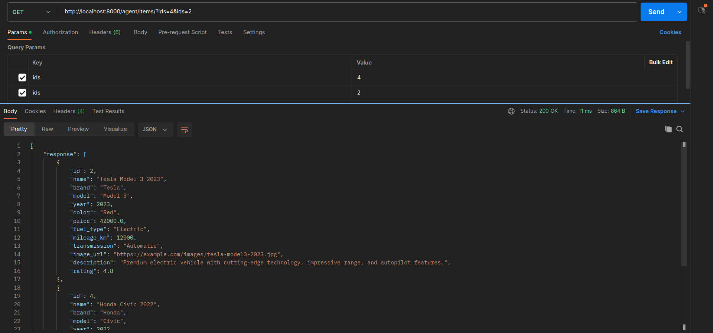
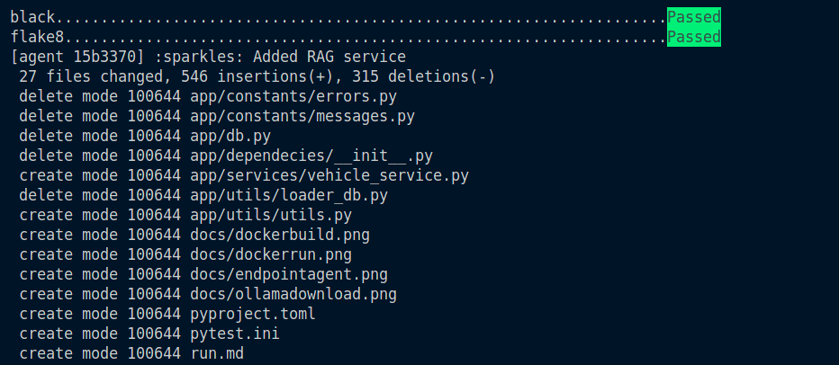
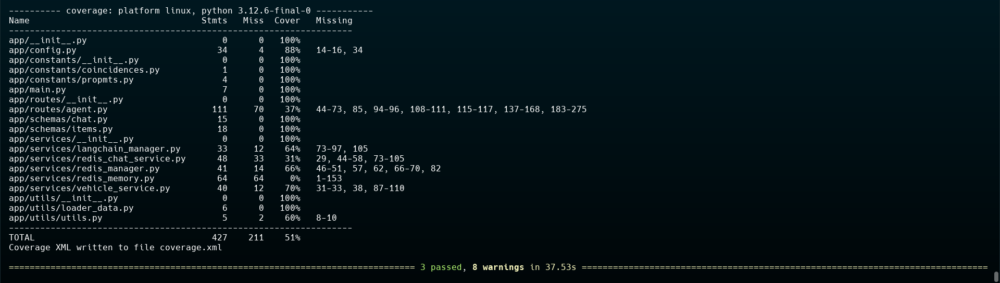

# Item Comparation
---

This project is a **FastAPI** backend and uses **Ollama** models to help retrive information from items, and responds intelligently using **LangChain**.

---

## ✨ Features
- ✅ Powered by **Ollama** for natural conversations  
- ✅ Built with **FastAPI** for scalability  
- ✅ Powered by **LangChain** for natural conversations  
---

## 📚 Endpoints
- GET `/agent/` : Health check endpoint.
- GET `/agent/redis/` : Test Redis connection.
- GET `/agent/generate/{prompt}` : Test Ollama model, generate response using user input.
- GET `/agent/items/` : Fetch data from fake database.
- POST `/agent/compare/` : Compare items using LLM with LangChain manager.
- POST `/agent/chat/` : Chat endpoint that maintains conversation context using Redis.

**Note:**
- The `/agent/chat/` endpoint is designed to handle vehicle-related queries using RAG (Retrieval-Augmented Generation) to provide relevant vehicle information.
- For other types of queries, the endpoint will use the LLM to generate a response.


## 🛠️ Requeriments
- Docker    
- Docker Compose
- Python >= 3.12


## 📚 How to use
`docker compose build`

`docker compose up`


**Now access to use API**
```
http://127.0.0.1:8000/docs
```

**Note:**
- To see more details about how to run the project see the run.md file.


## Example Responses
Fake data


Compare items using ids


Compare items using prompt


### 📂 Project Structure

Use of precommit to format code with black and flake8


Use of pytest to run unit tests



#### Example .env file
```
REDIS_HOST=xxxx
REDIS_PORT=xxxx
OLLAMA_URL=xxxx
OLLAMA_PORT=xxxx
```