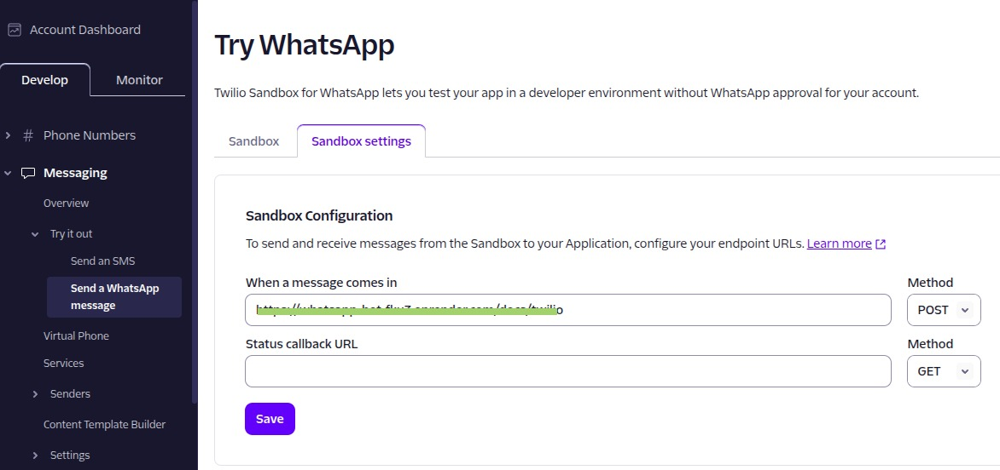

# 🚗 WhatsApp Car Sales Bot

This project is a **WhatsApp Chatbot** built with **FastAPI** and **OpenAI models** to help automate the sales process of car-related products.  
The bot connects to the **Twilio Sandbox**, receives customer messages, and responds intelligently using **LangChain**.
---

## ✨ Features
- ✅ Integration with **Twilio Sandbox**  
- ✅ Powered by **OpenAI models** for natural conversations  
- ✅ Built with **FastAPI** for scalability  
- ✅ `.env` configuration support (via `python-dotenv`)  
- ✅ Easily extendable to support multiple products and categories  
- ✅ Get a suggestion vehicle 
- ✅ Ask for vehicle using natural lenguage
- ✅ Ask for finacing using a budget
- ✅ Ask for company information


---

## 📂 Project Structure

```mermaid
graph TD
    A[app] --> B[constants]
    A --> C[dependencies]
    A --> D[routes]
    A --> E[schemas]
    A --> F[services]
    A --> G[utils]
    
    B --> B2[coincidences.py]
    B --> B3[errors.py]
    B --> B4[messages.py]
    B --> B5[prompts.py]
    
    C --> C2[dependency.py]
    
    D --> D2[bot.py]
    
    E --> E1a[chat_request.py]
    E --> E1b[prompt.py]
    
    F --> F2[chat_service.py]
    F --> F3[conversation_history.py]
    F --> F4[llm_service.py]
    F --> F5[rag_blog.py]
    F --> F6[rag.py]
    
    G --> G1[__init__.py]
    G --> G2[config.py]
    G --> G3[db.py]
    G --> G4[main.py]
    G --> G5[redis_memory.py]
    
    style A fill:#e1f5fe
    style B fill:#f3e5f5
    style C fill:#e8f5e8
    style D fill:#fff3e0
    style E fill:#fbe9e7
    style F fill:#e8eaf6
    style G fill:#f1f8e9
```




## 🛠️ Tools
- OpeanAI Account
- Twilio Account
- Ngrok Account (To expose API)

---

# How to run local
```
python3 -m venv venv
```

```
pip install -r requirements.txt
```

```
app.main:app --reload --port 8000
```

### Run with Dockerfile
```
docker build -t chatbot_img .
```

```
docker run --name chatbot_container --env-file .env -p 8000:8000 chatbot_img
```


### Use ngrok to expose webhook
**Note: Use Ngrok token**
```
ngrok http http://localhost:8000
```


**Now access to use API**
```
http://127.0.0.1:8000/docs
```

### Config Twilio
Access to Twilio account and add the ngrok endpoint to connet with Whatsapp.


----
### How to run it with Docker-compose

```
docker compose build
```

```
docker compose up
```


#### Example env file
```
OPENAI_API_KEY=xxxx
TWILIO_KEY=xxxx
TWILIO_ACCOUNT_SID=xxxx
REDIS_URL=xxxx
TO_WHATSAPP=xxxx
FROM_WHATSAPP=xxxx
CHROMA_DIR=./chroma_db
CHROMA_DB=autos
CHROMA_DB_BLOG=blog
```