# Item Comparation
---

This project is a **FastAPI** backend and uses **Ollama** models to help retrive information from items, and responds intelligently using **LangChain**.

---

## ✨ Features
- ✅ Powered by **Ollama** for natural conversations  
- ✅ Built with **FastAPI** for scalability  
- ✅ `.env` configuration support (via `python-dotenv`)  
- ✅ Ask for vehicle using natural lenguage

---

## 🛠️ Requeriments
- Ollama model runing
- Python 


You need to have Ollama installed in your system in order to run this project.

## How to run Ollama Model
```
ollama pull llama3
```


## How to run local API
```
python3 -m venv venv
```

```
pip install -r requirements.txt
```

```
uvicorn app.main:app --reload --port 8000
```

### Run with Dockerfile
```
docker build -t chatbot_img .
```

```
docker run --name chatbot_container --env-file .env -p 8000:8000 chatbot_img
```

**Now access to use API**
```
http://127.0.0.1:8000/docs
```


## 📂 Project Structure

```mermaid
graph TD
    A[app] --> B[constants]
    A --> C[dependencies]
    A --> D[routes]
    A --> E[schemas]
    A --> F[services]
    A --> G[utils]
    
    B --> B2[coincidences.py]
    B --> B3[errors.py]
    B --> B4[messages.py]
    B --> B5[prompts.py]
    
    C --> C2[dependency.py]
    
    D --> D2[bot.py]
    
    E --> E1a[chat_request.py]
    E --> E1b[prompt.py]
    
    F --> F2[chat_service.py]
    F --> F3[conversation_history.py]
    F --> F4[llm_service.py]
    F --> F5[rag_blog.py]
    F --> F6[rag.py]
    
    G --> G1[__init__.py]
    G --> G2[config.py]
    G --> G3[db.py]
    G --> G4[main.py]
    G --> G5[redis_memory.py]
    
    style A fill:#e1f5fe
    style B fill:#f3e5f5
    style C fill:#e8f5e8
    style D fill:#fff3e0
    style E fill:#fbe9e7
    style F fill:#e8eaf6
    style G fill:#f1f8e9
```




---

#### Example env file
```
OPENAI_API_KEY=xxxx
TWILIO_KEY=xxxx
TWILIO_ACCOUNT_SID=xxxx
REDIS_URL=xxxx
TO_WHATSAPP=xxxx
FROM_WHATSAPP=xxxx
CHROMA_DIR=./chroma_db
CHROMA_DB=autos
CHROMA_DB_BLOG=blog
```