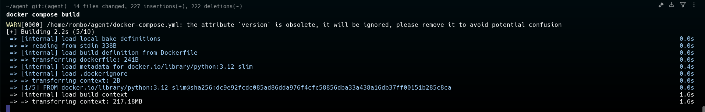
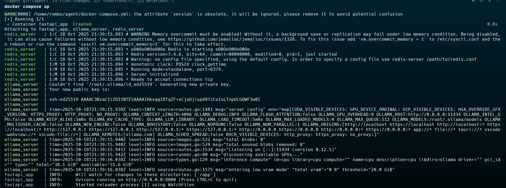
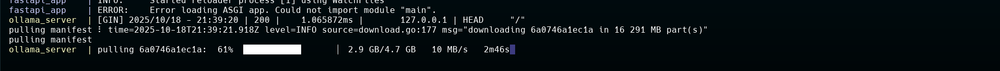
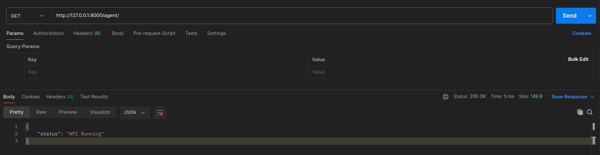

## Prerequisites
- Python >= 3.12
- Docker
- Docker Compose

## Setup Instructions

1. **Build and run the containers**
   ```
   docker compose build
   ```
   

   ```
   docker compose up
   ```
   

   **Note:**
   - Download Ollama Model it will take a while
   

2. **Access the API documentation**
   ```
   http://127.0.0.1:8000/docs
   ```

3. **Use the API**
   Example using POSTMAN
   - http://127.0.0.1:8000/agent/
   